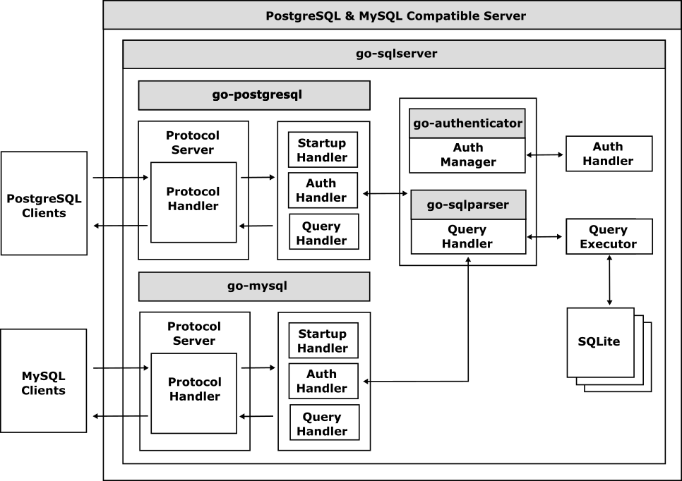

# go-sqlserver

 

The `go-sqlserver` is a database framework for implementing a [MySQL](https://www.mysql.com/)-compatible and a [PostgreSQL](https://www.postgresql.org/)-compatible server using Go easily.
This framework is ideal for building mock servers for testing, custom database solutions, or learning purposes.

## What is the go-sqlserver?

The `go-sqlserver` provides a set of tools and libraries to create custom SQL servers that can handle MySQL and PostgreSQL protocols. It abstracts the complexities of protocol handling, query parsing, and execution, allowing developers to focus on implementing the business logic and data storage mechanisms.

The `go-sqlserver` provides a unified implementation framework of authentication and query handlers for both MySQL and PostgreSQL, allowing developers to build custom SQL servers that support both protocols. The framework is designed to be extensible, allowing developers to add custom query handlers, authentication mechanisms, and data storage backends.
By using the framework , developers can easily build an SQL server that supports both MySQL and PostgreSQL protocols.

The `go-sqlserver` is currently implemented as an in-memory database using SQLite as the default data store. This allows for quick and efficient data operations without the need for an external database server.

## Get Started

See the following guide to learn about how to get started.

- [Quick Start](doc/quick-start.md) 
  - [Configuring go-sqlserver](doc/configuring.md)
- Secifications
  - [Data Model](doc/data_model.md)
  - [Query Model](doc/query_model.md)

# Related Projects

The `go-sqlserver` is being developed in collaboration with the following Cybergarage projects:

- [go-postgresql](https://github.com/cybergarage/go-postgresql) 
- [go-mysql](https://github.com/cybergarage/go-mysql) 
- [go-sqlparser](https://github.com/cybergarage/go-sqlparser) 
- [go-logger](https://github.com/cybergarage/go-logger) 
- [go-safecast](https://github.com/cybergarage/go-safecast) 
- [go-tracing](https://github.com/cybergarage/go-tracing) 
- [go-authenticator](https://github.com/cybergarage/go-authenticator) 
- [go-sasl](https://github.com/cybergarage/go-sasl) 
- [go-sqltest](https://github.com/cybergarage/go-sqltest) 
- [go-pict](https://github.com/cybergarage/go-pict) 
